### Nama: Dimas Riyadh Alfajri
### Kelas: TI.20.A1
### Nim: 312010029
### Matkul: Pemrograman Web

# Praktikum 5: Javascript

### Pengantar Javascript
Javascript adalah bahasa pemrograman yang awalnya dirancang untuk berjalan di atas browser.
Namun, seiring perkembangan zaman, javascript tidak hanya berjalan di atas browser saja.
Javascript juga dapat digunakan pada sisi Server, Game, IoT, Desktop, dsb.

## Langkah-Langkah :

Persiapan membuat dokumen HTML dengan nama file lab5_javascript.html seperti berikut.

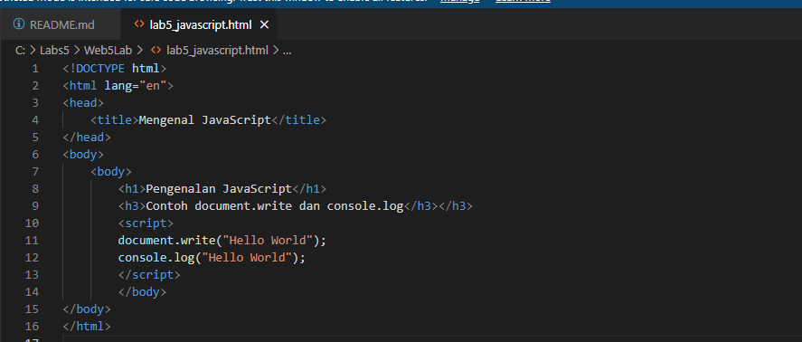

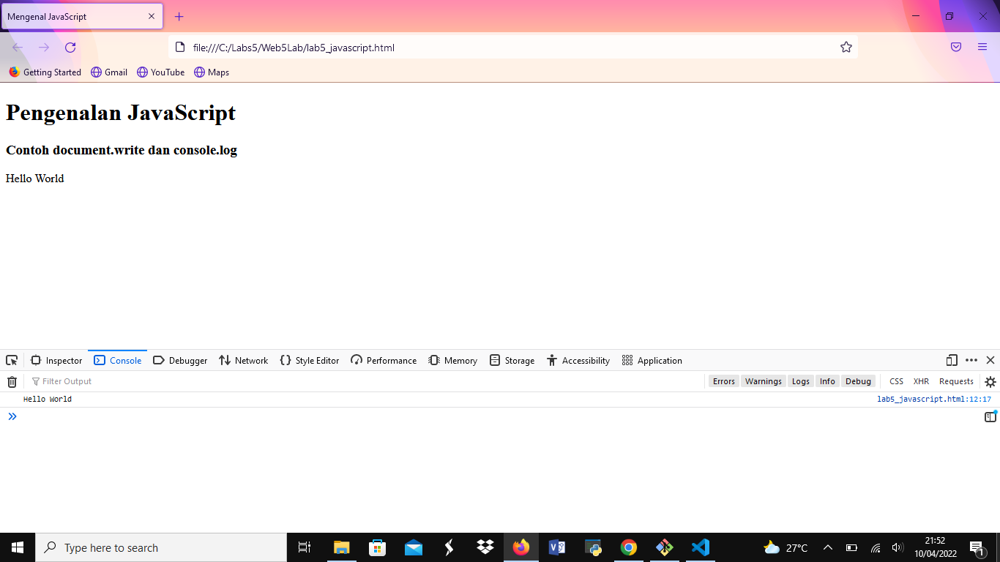

### Javascript Dasar

Pemakaian Alert sebagai property window.

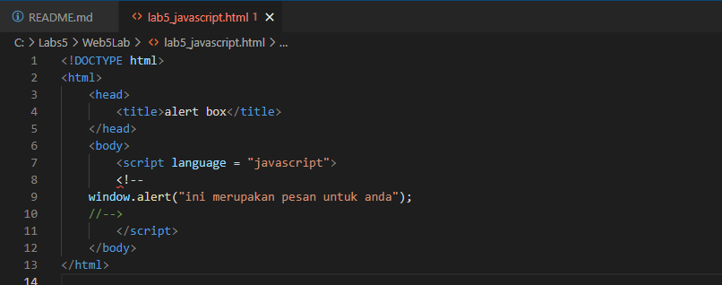

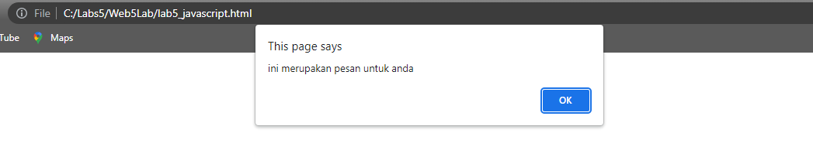

Pemakaian method dalam objek

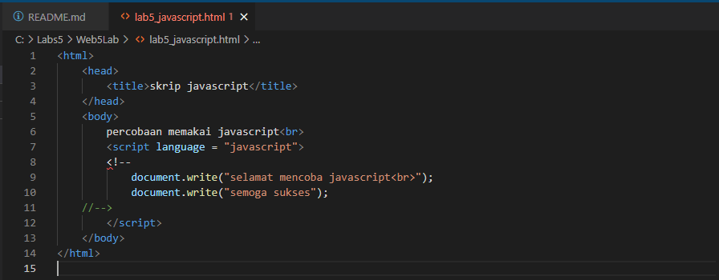

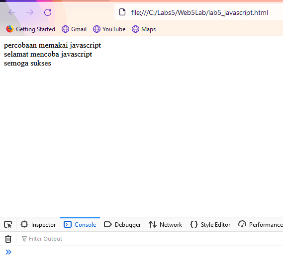

Pemakaian Prompt

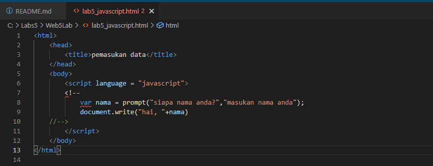

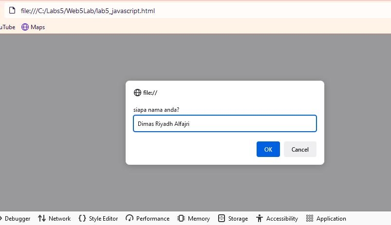

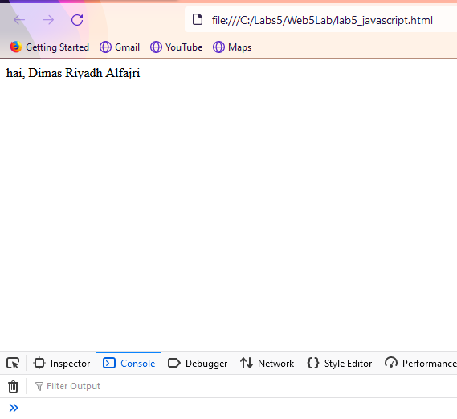

Pembuatan fungsi dan cara pemanggilannya

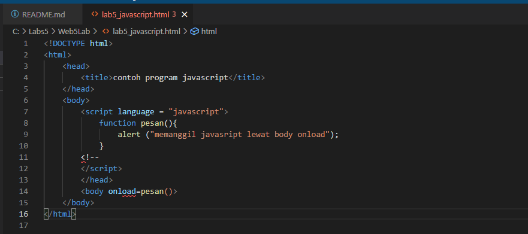

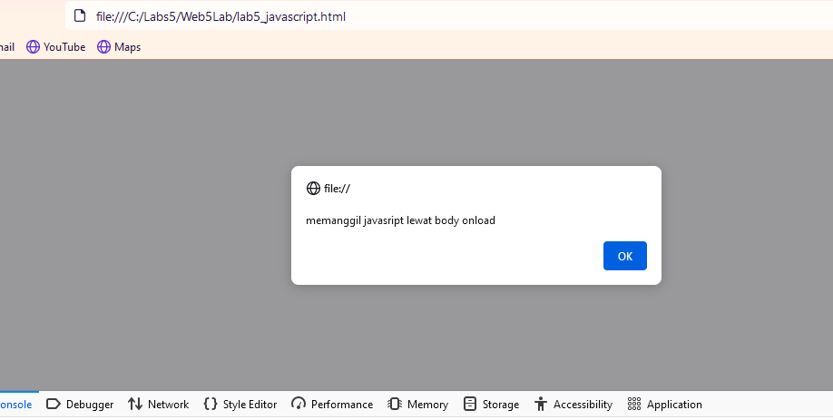

### Dasar Pemrograman di Javascript

Operasi dasar aritmatika

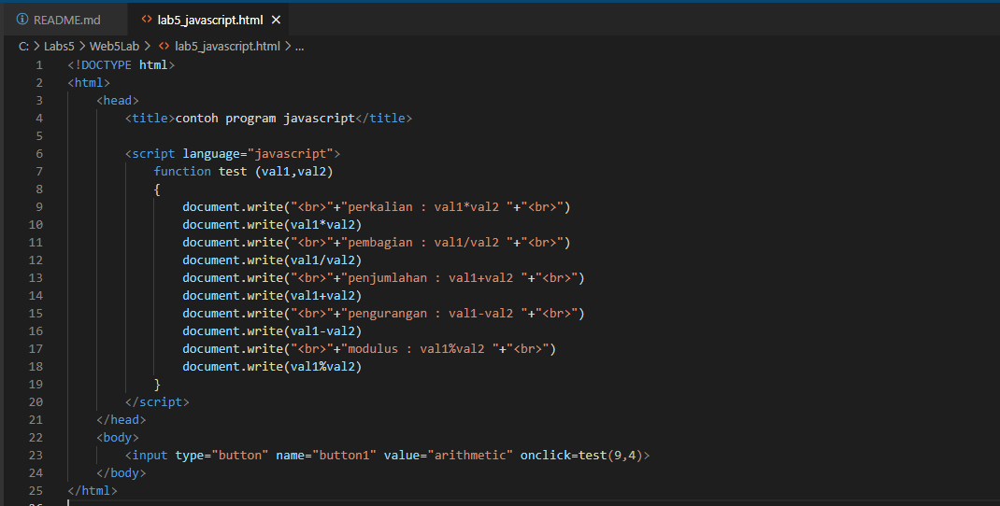

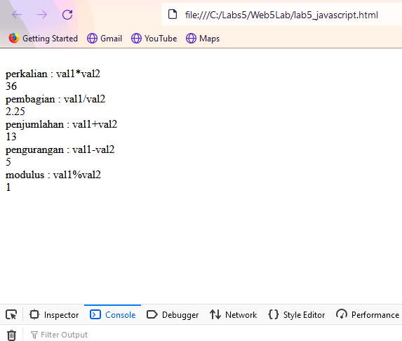

Seleksi kondisi (if..else)

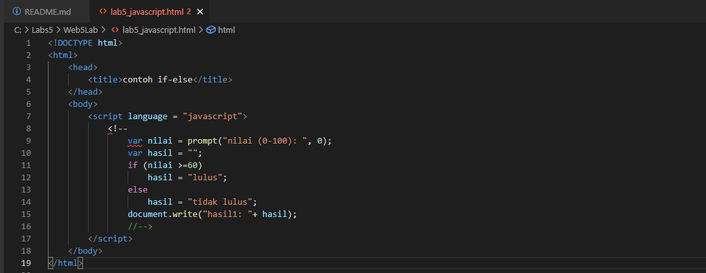

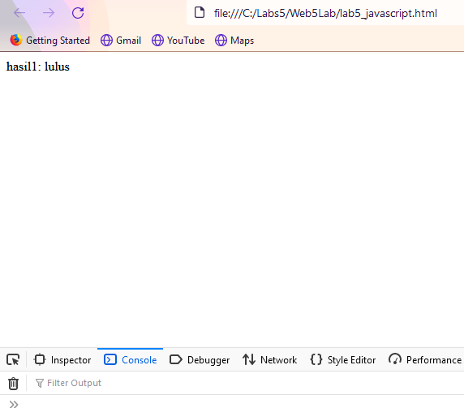

Penggunaan operator switch untuk seleksi kondisi

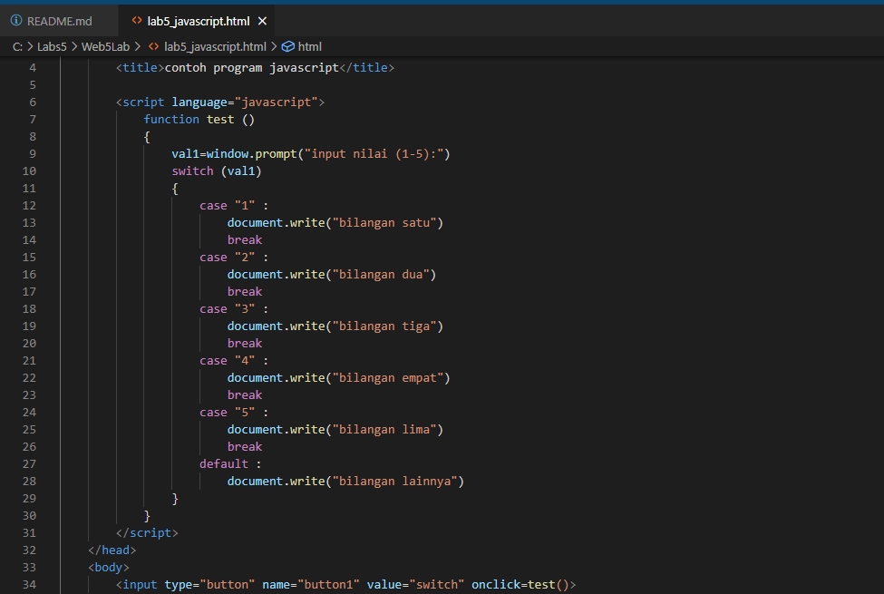

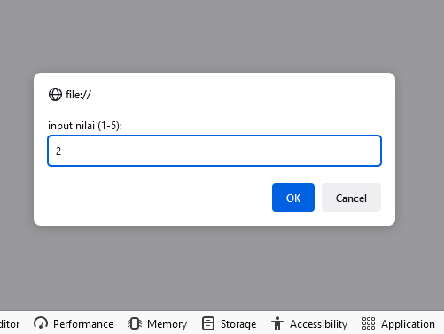

