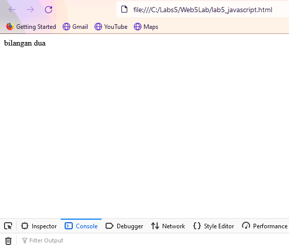
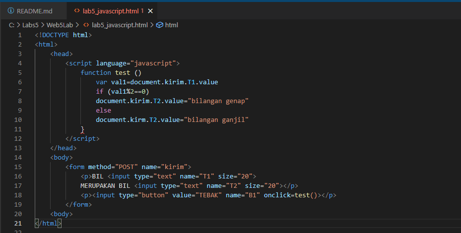
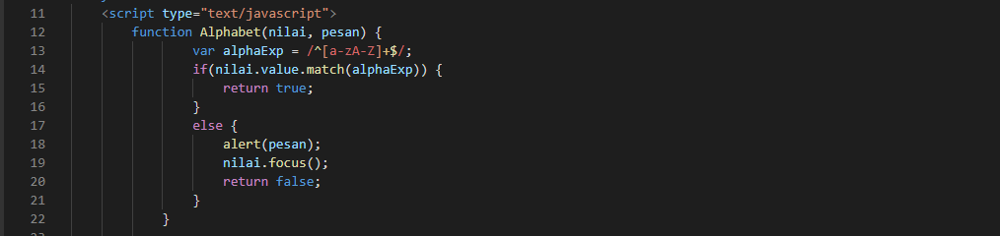

### Nama: Dimas Riyadh Alfajri
### Kelas: TI.20.A1
### Nim: 312010029
### Matkul: Pemrograman Web

# Praktikum 5: Javascript

### Pengantar Javascript
Javascript adalah bahasa pemrograman yang awalnya dirancang untuk berjalan di atas browser.
Namun, seiring perkembangan zaman, javascript tidak hanya berjalan di atas browser saja.
Javascript juga dapat digunakan pada sisi Server, Game, IoT, Desktop, dsb.

## Langkah-Langkah :

Persiapan membuat dokumen HTML dengan nama file lab5_javascript.html seperti berikut.

### Javascript Dasar

Pemakaian Alert sebagai property window.

Pemakaian method dalam objek

Pemakaian Prompt

Pembuatan fungsi dan cara pemanggilannya

### Dasar Pemrograman di Javascript

Operasi dasar aritmatika

Seleksi kondisi (if..else)

Penggunaan operator switch untuk seleksi kondisi

### Pembuatan Form

Form input

Form Button.

### Html DOM

Pilihan ini menggunakan checkbox dengan perhitungan otomatis

### Pertanyaan dan Tugas 

 1.Buat script untuk melakukan validasi pada isian form

### Jawaban!

Yaitu Membuat validasi nama, No.Telp, Email.

### Nama

Disini saya akan memberikan validasi berupa inputan hanya boleh menggunakan Huruf/Alphabet saja. Contoh : DimasRiyadh (benar), DimasRiyadhjr (salah)

Penjelasan

 Membuat nama function Alphabet, dengan parameter dinamis yaitu (nilai,pesan)
 Data yang boleh dimasukkan adalah berupa "a-zA-Z"
 Jika selain data "a-zA-Z" ini dimasukkan, maka akan muncul pesan Alert "alert(pesan);"

### No.Telp

Pada bagian ini akan saya berikan validasi berupa hanya angka saja yang boleh di inputkan, contoh: 12345 (benar), 123AB (salah).

Penjelasan:

 var numberExp = /^[0-9]+$/; merupakan variabel numberExp yang diberi batasan validasi angka 0-9
 Arti Match pada "if(nilai.value.match(numberExp))" adalah string.match(), mencari string menggunakan Regular Expression (Regex)
 Jika salah atau inputan tidak benar maka akan ada pesan alert "alert(pesan);"

### Email

Pada email akan diberikan validasi masih berupa Regular Expression. Contoh: dimasriyadh8291@gmail.com (benar), dimasriyadh8291@.com (salah).

Penjelasan:

 membuat variabel email " var email = /^([a-zA-Z0-9_.+-])+@(([a-zA-Z0-9-])+.)+([a-zA-Z0-9]{2,4})+$/; " berupa huruf, angka dan simbol yang diperbolehkan dalam input sebuah email. Jika email salah maka akan ada pesan alert "alert(pesan);"

### Berikut Penulisan Form yang benar

Cukup sekian dan Terimakasih.

